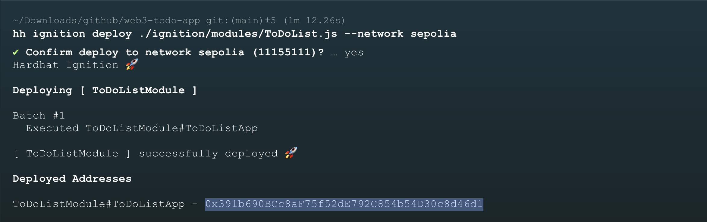
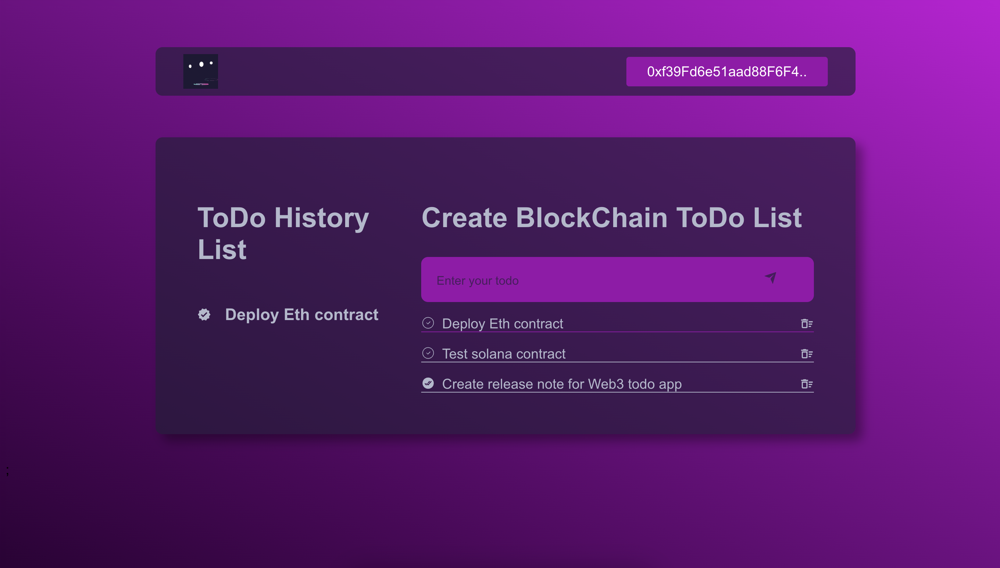

# Web3 Todo List App

## 📍 Acknowledgments

This Web3 Todo List app is an exact replication of the [repository](https://github.com/daulathussain/complete-ToDo-App/tree/main) by [@daulathussain](https://github.com/daulathussain), meticulously developed by following the comprehensive video tutorial from [theblockchaincoders](https://www.theblockchaincoders.com/course/multi-signature-wallet-dapp).

## 📖 Project Overview

This decentralized Todo List application demonstrates the integration of blockchain technology with a modern web framework. Built as a learning project, it showcases smart contract development, frontend implementation, and Web3 wallet integration.

## 🏗️ Table of Contents  

1. [Features](#-features)  
2. [Technologies](#-technologies)  
3. [Installation & Setup](#-installation--setup)  
   - [Prerequisites](#-prerequisites)  
   - [Deploy the Contract and Configure the Project](#-deploy-the-contract-and-configure-the-project)  
   - [Configure Hardhat](#-configure-hardhat)  
   - [Running the Project](#-running-the-project)  
4. [Application UI](#-application-ui)
6. [Connect](#-connect)


## 🌟 Features

- **Decentralized Task Management**
  - Create and manage Todo items on the Ethereum blockchain
  - User-specific task ownership
  - Transparent and immutable task tracking

- **User-Centric Design**
  - Multiple users can view all Todo items
  - Task creators have exclusive rights to mark tasks as done/undone or remove it.
  - Secure authentication via MetaMask

## 🚀 Technologies

| Category | Technologies |
|----------|--------------|
| Frontend | Next.js |
| Smart Contract | Solidity, Hardhat |
| Network | Ethereum (Sepolia Testnet) |
| Wallet | MetaMask |

## 📦 Installation & Setup 

### 🛠 Prerequisites

- Node.js (v18+)
- npm
- Hardhat
- MetaMask Browser Extension
- Blockchain Provider API Key (Infura/Alchemy)

### 🚀 Deploy the Contract and Configure the Project

1. Clone the repository:  
    ```bash
    git clone https://github.com/ajaykumargdr/eth-crypto-wallet.git
    cd web3-todo-list
    ```  

2. Deploy the smart contract using Hardhat Ignition:  
    ```bash
    npx hardhat ignition deploy ./ignition/modules/ToDoList.js --network sepolia
    ```  

3. After deployment, copy the deployed contract address from the output:  
    

4. Update the `contract_address.json` file with your deployed contract address:  
    ```json  
    {
        "address": "<YOUR_CONTRACT_ADDRESS>"
    }  
    ```  

---

### ⛑️ Configure Hardhat  

To deploy the contract on your own network or using a different provider, update the `hardhat.config.js` file as shown:  

```javascript  
module.exports = {
  solidity: "0.8.27",
  defaultNetwork: "localhost",
  networks: {
    localhost: {
      url: "http://127.0.0.1:8545",  // Connects to the Hardhat local node
    },
    sepolia: {
      url: "<YOUR_PROVIDER_API_KEY>", // Add your provider's API key (Infura/Alchemy)
      accounts: ["<YOUR_ACCOUNT_PRIVATE_KEY>"], // Add your private key
    },
  },
};
```

> To deploy on the Ethereum mainnet, modify the networks section accordingly and use the --network mainnet flag:
> ```bash
> npx hardhat ignition deploy ./ignition/modules/ToDoList.js --network mainnet
> ```

### 🖥 Running the project
Start the Development Server
Install dependencies:

```bash
npm install
```
Start the development server:

```bash
npm run dev
```

### 🏠 Application UI


---
## 🔗 Connect

[LinkedIn](https://www.linkedin.com/in/ajaykumarm2003/) | [X](https://x.com/ajayKumarM0)